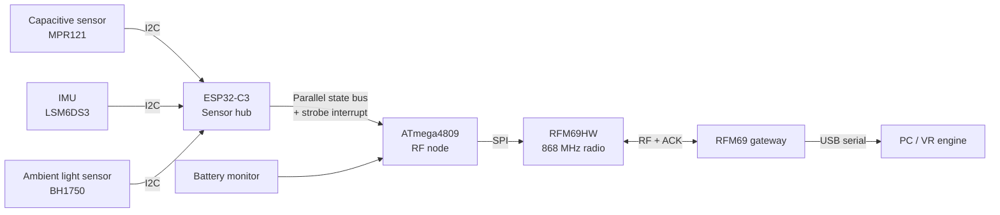

# RF-Connected Training Baton for VR

> A wireless embedded prototype that detects the use state of a training baton and sends compact events to a VR gateway.


## Table of Contents

- [Project Overview](#project-overview)
- [Main Features](#main-features)
- [System Architecture](#system-architecture)
- [Hardware](#hardware)
- [Firmware and Repository Layout](#firmware-and-repository-layout)
- [Finite State Machine](#finite-state-machine)
- [Wireless Protocol](#wireless-protocol)
- [Installation and Build](#installation-and-build)
- [Testing and Calibration](#testing-and-calibration)
- [Validation Results](#validation-results)
- [Known Limitations](#known-limitations)
- [Future Improvements](#future-improvements)


---

## Project Overview

This repository contains the firmware and test tools for an **RF-connected training baton prototype** designed for virtual-reality training environments.

The project creates a physical baton mock-up that can detect important interaction events:

- baton stored in its holster;
- baton held in a hand;
- baton opened or deployed;
- baton placed on the ground;
- impact or strike event;
- low-battery or error condition.

The baton sends these events wirelessly to a gateway. The gateway forwards the received information to a computer or VR application through a serial connection.

The system is designed as a **training proof of concept**. Its purpose is to improve realism in safe training scenarios. It is not intended for operational, defensive, or law-enforcement use.

## Main Features

- 868 MHz RF communication between a wearable node and a USB gateway.
- Compact one-byte payload for low radio overhead.
- Capacitive sensing to identify hand contact.
- Ambient light sensing to identify whether the baton is inside the holster.
- IMU-based detection of deployment motion and impact peaks.
- ESP32-C3 sensor hub to offload sensor processing from the main RF node.
- ATmega4809 main node for radio communication and battery monitoring.
- Interrupt-driven event queue to reduce the risk of missed events.
- Battery charging, protection, and low-voltage monitoring.
- Python testbench scripts for sensor calibration and monitoring.

---

## System Architecture



### Why two microcontrollers?

The node uses two processors because sensor processing and radio communication have different timing needs.

- The **ESP32-C3** reads the sensors, applies filtering, and runs the finite state machine.
- The **ATmega4809** manages the RFM69 radio, queues state changes, and checks battery voltage.
- A parallel bus with a strobe signal transfers the current state to the ATmega4809 with very low latency.

This separation reduces radio timing jitter and helps preserve fast motion or impact events.

---

## Hardware

### Main components

| Subsystem | Component | Role |
|---|---|---|
| Main RF node | ATmega4809 | Runs RF communication, event queue, and battery monitoring. |
| Sensor coprocessor | ESP32-C3 | Reads sensors and runs the finite state machine. |
| RF link | RFM69HW, 868 MHz | Sends events from the baton to the gateway. |
| Capacitive sensor | MPR121 | Detects hand contact and follows slow environmental drift. |
| Motion sensor | LSM6DS3 IMU | Detects deployment motion and impact peaks. |
| Light sensor | BH1750 / GY-302 | Detects darkness inside the holster. |
| Battery | Samsung INR18650-25R or compatible 18650 Li-ion cell | Powers the complete system. |
| Charger and protection | TP4056, DW01A, FS8205A | Provides charging and basic cell protection. |
| Power rails | ME6211 and NCP189 LDOs | Creates separate 3.3 V supplies for the sensor hub and RF node. |

### Power design

The prototype uses a single rechargeable 18650 Li-ion battery.

- Usable voltage range: approximately **3.5 V to 4.2 V**.
- USB-C input for charging.
- TP4056 constant-current / constant-voltage charging stage.
- Target charging current: approximately **1 A**.
- Separate low-dropout regulators reduce noise between the ESP32-C3 sensor domain and the RF node domain.

The original prototype measured an average current close to **47.46 mA**. With an estimated usable capacity of around **2000 mAh**, the expected autonomy is approximately **42 hours**. Real autonomy depends on radio traffic, sensor settings, battery age, and temperature.

### Mechanical integration

The electronics are designed to fit inside a baton-shaped training enclosure and holster.

Important mechanical requirements are:

- no moving electronics inside the enclosure;
- enough resistance for repeated training impacts;
- short, protected internal wiring;
- compatibility with the intended holster;
- correct sensor position for reliable hand and holster detection.

---

## Firmware and Repository Layout

```text
.
├── FSM.ino                 # Finite state machine logic
├── Node.ino                # Baton RF node firmware
├── Gateway.ino             # USB RF gateway firmware
├── Capa_testbench.ino      # Capacitive sensor acquisition test
├── Capa_testbench.py       # Capacitive sensor data visualisation / analysis
├── IMU_testbench.ino       # IMU acquisition test
└── IMU_testbench.py        # IMU data visualisation / analysis
```

### File purpose

| File | Purpose |
|---|---|
| `FSM.ino` | Contains the state model that combines sensor information into a baton state. |
| `Node.ino` | Runs on the baton node. It receives state changes, stores them in a queue, sends RF packets, and monitors the battery. |
| `Gateway.ino` | Runs on the RF gateway. It receives packets and forwards decoded data to a PC through USB serial. |
| `Capa_testbench.ino` | Sends capacitive sensor readings for calibration. |
| `Capa_testbench.py` | Helps inspect capacitive readings and choose stable thresholds. |
| `IMU_testbench.ino` | Sends IMU samples for deployment and impact analysis. |
| `IMU_testbench.py` | Helps plot IMU data and tune motion / impact thresholds. |

> **Note:** Pin definitions, sensor addresses, radio network ID, radio encryption key, and serial ports should be reviewed in the source files before uploading firmware.

---

## Finite State Machine

The project uses an 8-state finite state machine (FSM). The FSM transforms raw sensor data into a small set of useful VR events.

| Code | State | Meaning |
|---:|---|---|
| `000` | `INIT` | Startup and first sensor validation. |
| `001` | `HOLSTER` | Baton is inside the holster. |
| `010` | `HAND_CLOSED` | Baton is held in the hand and not deployed. |
| `011` | `HAND_OPEN` | Baton is held in the hand and deployed. |
| `100` | `GROUND_CLOSED` | Baton is on the ground and not deployed. |
| `101` | `GROUND_OPEN` | Baton is on the ground and deployed. |
| `110` | `HIT` | An impact event was detected. |
| `111` | `ERROR` | A critical error or low-voltage condition was detected. |

### Simplified state logic


### Sensor roles in the FSM

- **BH1750 light sensor:** A dark reading indicates that the baton is probably inside the holster. In this state, touch and IMU events can be blocked to reduce false positives.
- **MPR121 capacitive sensor:** Detects whether the baton is in contact with a hand.
- **IMU:** Detects fast deployment movement and impact acceleration peaks.

Thresholds must be calibrated with the final enclosure because plastics, electrode position, moisture, and user grip can change sensor values.

---

## Wireless Protocol

The radio link uses the RFM69HW module in the **868 MHz** band.

The project uses this band to reduce interference from Wi-Fi, Bluetooth, and other common 2.4 GHz devices used in VR rooms. It can also offer better indoor penetration around the body and equipment.

### Payload format

Each event uses a one-byte payload:

```text
0b00BBBFFF
```

| Bits | Field | Description |
|---|---|---|
| `7:6` | Reserved | Currently set to `00`. |
| `5:3` | `BBB` | Battery level encoded on 3 bits. |
| `2:0` | `FFF` | Current FSM state encoded on 3 bits. |

### Event delivery

The node follows this sequence:

1. The ESP32-C3 updates the parallel state bus.
2. A strobe triggers an interrupt on the ATmega4809.
3. The ATmega4809 stores the event in an 8-slot FIFO ring buffer.
4. The main loop sends the event through the RFM69 radio.
5. The gateway returns an acknowledgement (ACK).
6. The radio library retries the transmission when an ACK is missing.

The current design uses `sendWithRetry()` and can perform up to three retries with a waiting period of about 40 ms per retry.

---

## Installation and Build

### 1. Install the development environment

Use one of the following tools:

- Arduino IDE 2.x; or
- PlatformIO with Arduino framework support.

Install board support for:

- ATmega4809-based board used by the node;
- ESP32-C3;
- microcontroller used by the gateway, if different from the node.

### 2. Install required Arduino libraries

Install libraries compatible with the hardware used in your version of the prototype:

- RFM69 library providing `RFM69.h`;
- MPR121 capacitive sensor library;
- BH1750 light sensor library;
- LSM6DS3 IMU library;
- Wire / SPI libraries supplied with the Arduino platform.

Use library versions that match the API used in the source code. Check compiler messages carefully because different libraries can expose different function names.

### 3. Configure the firmware

Before compiling, review these values in the `.ino` files:

- radio frequency: `868 MHz`;
- node and gateway IDs;
- network ID;
- optional radio encryption key;
- sensor I2C addresses;
- GPIO mapping for the parallel bus and strobe interrupt;
- battery ADC pin and voltage-divider ratio;
- serial baud rate;
- capacitive, light, deployment, and impact thresholds.

### 4. Upload order

1. Upload `Gateway.ino` to the gateway board.
2. Open the serial monitor and confirm that the gateway starts correctly.
3. Upload `FSM.ino` / sensor firmware to the ESP32-C3 according to your project setup.
4. Upload `Node.ino` to the ATmega4809 RF node.
5. Power the baton node.
6. Confirm that state packets appear on the gateway serial port.

### 5. Basic serial check

A received packet should provide enough information to identify:

- source node;
- FSM state;
- battery level;
- optional RSSI or diagnostic information, depending on the gateway firmware.

---

## Testing and Calibration

Calibration should be completed before full system integration.

### Capacitive sensor testbench

1. Upload `Capa_testbench.ino`.
2. Open the serial port used by the testbench.
3. Record readings in the following conditions:
   - no hand contact;
   - normal hand grip;
   - gloves, if used during training;
   - humid or dry conditions;
   - baton inside the holster.
4. Run the Python analysis script.
5. Select thresholds with enough margin between idle and touch values.

Example command:

```bash
python Capa_testbench.py
```

### IMU testbench

1. Upload `IMU_testbench.ino`.
2. Record samples for normal handling, deployment flicks, weak contacts, and strong training impacts.
3. Run the Python analysis script.
4. Check that the selected thresholds detect intended events without false hits.

Example command:

```bash
python IMU_testbench.py
```

### Recommended Python environment

The Python scripts may require standard data-analysis packages. A simple environment can be created with:

```bash
python -m venv .venv
# Linux / macOS
source .venv/bin/activate
# Windows PowerShell
# .venv\Scripts\Activate.ps1

pip install pyserial pandas matplotlib
```

Edit the serial port and baud-rate configuration in the Python script if required.

---

## Validation Results

The current proof-of-concept validation included component tests, FSM checks, radio reliability checks, and serial diagnostics.

| Test area | Result reported for the prototype |
|---|---|
| Capacitive sensing | Separate testbench calibration was performed before integration. |
| IMU sensing | Deployment and impact signatures were captured and analysed before integration. |
| FSM logic | The 8-state model was tested for holster, hand, ground, and hit transitions. |
| Radio acknowledgement | ACK mode was tested over event intervals from 10 ms to 100 ms. |
| Recommended event interval | Approximately 20 ms to 50 ms. |
| Measured communication behaviour | Approximately 20 ms median latency and 0% packet loss in the reported benchmark. |
| Indoor RF range | More than 100 m in the reported indoor validation. |
| Monitoring | A Python tool decoded the one-byte payload in real time. |

These results describe the tested prototype. They are not guaranteed for a different enclosure, antenna, battery, radio configuration, or building.

---

## Known Limitations

- The system is a proof of concept and requires calibration for each mechanical version.
- Fast corner-case transitions can occasionally produce a non-critical FSM freeze.
- Manual internal wiring can be sensitive to repeated impacts and vibration.
- The PLA prototype may not match the final dimensions or robustness of an operational baton-shaped object.
- The TP4056 linear charger can generate heat during 1 A charging.
- Battery level is encoded with only three bits, so it is a coarse estimate.
- The VR application interface is gateway/serial based and may need an adapter for a specific game engine or simulation framework.

---

## Future Improvements

### Power and thermal design

- Add copper planes and thermal vias around the TP4056 charger.
- Add a hardware enable line or MOSFET switch to shut down the ESP32-C3 at low battery voltage.
- Add charging-state telemetry by measuring USB input voltage through a resistor divider.

### Mechanical robustness

- Replace temporary PLA parts with a stronger and more realistic material such as polycarbonate.
- Move from fly-wire connections to a monolithic PCB.
- Use polarized low-profile locking connectors, for example JST-SH connectors.

### Electrical protection

- Add reverse-polarity protection at the battery input.
- Add a resettable fuse on the main power rail.
- Add TVS diodes near exposed signal lines to reduce ESD risk.

### Software

- Add watchdog recovery for rare FSM freezes.
- Store calibration profiles for different users or environmental conditions.
- Add structured packet logging with timestamps and RSSI values.
- Add a documented PC-to-VR API or a Unity / Unreal Engine plugin.

---

